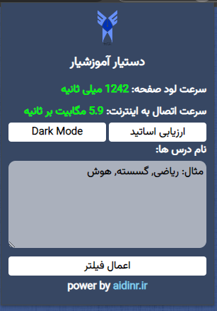

## دستیار آموزشیار
امکاناتی که درحال حاضر این دستیار به شما ارائه میدهد:

- اضافه کردن حالت دارک مود به آموزشیار
- نمایش وضعیت لودتایم و سرعت اینترنت
- امکان سرچ همزمان چند درس با سرعت بیشتر بدون نیاز به تبدیل اسم درس
- تیک زدن خودکار ارزیابی اساتید
- تغییرات کوچیک ظاهری

